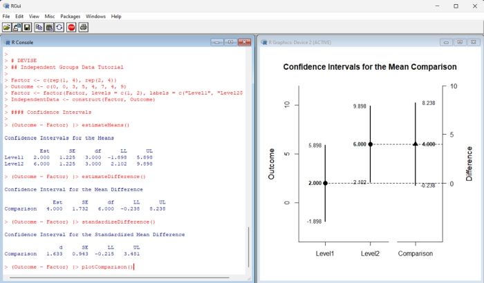
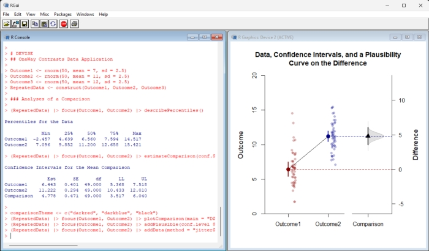

# `DAVISE` 

## Data Analysis, Visualization, and Inference with Statistical Estimation

[](https://cran.r-project.org/)
[](https://opensource.org/licenses/MIT)

### Overview

**DAVISE** is an R package that implements features of estimation statistics and data visualization in a pipe-oriented framework. Its primary functions describe, estimate, test, and plot confidence intervals for means, mean comparisons, correlations, and standardized effect sizes in between- and within-subjects single-factor, factorial, and mixed designs. Most functions can take either raw data or summary statistics as input.



Other functions extend the analysis capabilities by offering summaries and plots of data, frequencies, densities, and more. These features can be combined to produce images similar to those from other estimation statistics implementations. 



### Installation

This R package is not currently on CRAN, but the latest version can be installed and loaded using these R commands:

``` r
install.packages("remotes")
remotes::install_github("cwendorf/DAVISE")
library(EASI)
```

If you do not wish a full install, the latest functions can be made available using these R commands:

``` r
source("http://raw.githubusercontent.com/cwendorf/DAVISE/main/source-DAVISE.R")
```

### Usage

The package includes a wide variety of materials that demonstrate its use:

- [Introduction](https://cwendorf.github.io/DAVISE/articles/Introduction.html) - A quick overview and summary of the package
- [Reference](https://cwendorf.github.io/DAVISE/reference/index.html) - Reference documentation of the functions of the package
- [Articles](https://cwendorf.github.io/DAVISE/articles/index.html) - Examples and applications of features of the package

### Contact Me

- GitHub Issues: [https://github.com/cwendorf/DAVISE/issues](https://github.com/cwendorf/DAVISE/issues) 
- Author Email: [cwendorf@uwsp.edu](mailto:cwendorf@uwsp.edu)
- Author Homepage: [https://cwendorf.github.io](https://cwendorf.github.io)

### Citation

Wendorf, C. A. (2022). *DAVISE: Data Analysis, Visualization, and Inference with Statistical Estimation* [R Package]. [https://cwendorf.github.io/DAVISE/](https://cwendorf.github.io/DAVISE/)
