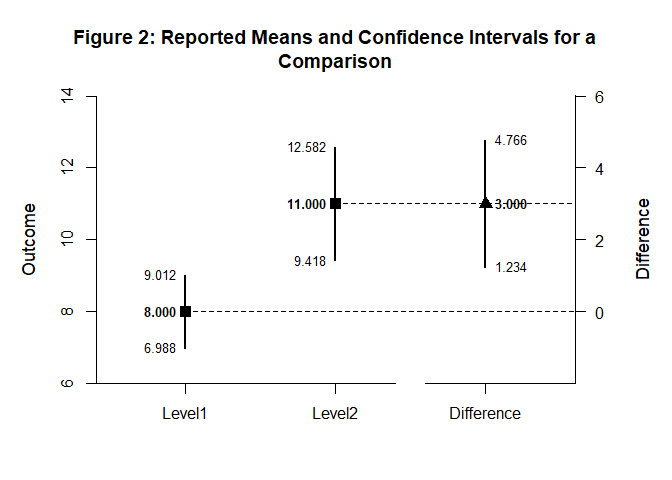

# [`DEVISE`](https://github.com/cwendorf/DEVISE/)

## Direct Input Examples

Tjhis vignette demonstrates how to directly input reported statistics
from published or secondary sources to present estimation results.
`DEVISE` handles the assembly, formatting, and visualization of these
externally-sourced values without any computation.

- [Case 1: Estimates from a Single
  Source](#case-1:-estimates-from-a-single-source)
  - [Examine the Conditions](#examine-the-conditions)
  - [Display the Conditions](#display-the-conditions)
  - [Examine a Comparison](#examine-a-comparison)
  - [Display a Comparison](#display-a-comparison)
- [Case 2: Estimates from Multiple
  Sources](#case-2:-estimates-from-multiple-sources)
  - [Examine the Studies](#examine-the-studies)
  - [Display the Studies](#display-the-studies)

------------------------------------------------------------------------

### Case 1: Estimates from a Single Source

#### Examine the Conditions

When working with published studies or secondary data sources, you can
directly input the reported estimates and confidence intervals. This
approach is useful for meta-analyses, literature reviews, or when
reconstructing results from research reports.

``` r
c(Estimate = 8.000, LL = 6.988, UL = 9.012) -> Level1
c(Estimate = 11.000, LL = 9.418, UL = 12.582) -> Level2
c(Estimate = 12.000, LL = 10.248, UL = 13.752) -> Level3

rbind(Level1, Level2, Level3) -> Conditions
c("Level1", "Level2", "Level3") -> rownames(Conditions)
```

#### Display the Conditions

Format the condition matrix and visualize the intervals.

``` r
Conditions |> style_matrix(title = "Table 1: Means and Confidence Intervals for Conditions", style = "apa")
```


    Table 1: Means and Confidence Intervals for Conditions 

    --------------------------------------- 
             Estimate         LL         UL 
    --------------------------------------- 
    Level1      8.000      6.988      9.012
    Level2     11.000      9.418     12.582
    Level3     12.000     10.248     13.752 
    --------------------------------------- 

``` r
Conditions |> plot_conditions(title = "Figure 1: Means and Confidence Intervals for Conditions", values = TRUE)
```

<!-- -->

#### Examine a Comparison

In addition to condition-level estimates, you can directly input
comparison results reported in published studies.

``` r
c(Estimate = 3.000, LL = 1.234, UL = 4.766) -> Difference

rbind(Level1, Level2, Difference) -> Comparison
c("Level1", "Level2", "Difference") -> rownames(Comparison)
```

#### Display a Comparison

Present the comparison in a formatted table and plot.

``` r
Comparison |> style_matrix(title = "Table 2: Reported Means and Confidence Intervals for a Comparison", style = "apa")
```


    Table 2: Reported Means and Confidence Intervals for a Comparison 

    ------------------------------------------- 
                 Estimate         LL         UL 
    ------------------------------------------- 
    Level1          8.000      6.988      9.012
    Level2         11.000      9.418     12.582
    Difference      3.000      1.234      4.766 
    ------------------------------------------- 

``` r
Comparison |> plot_comparison(title = "Figure 2: Reported Means and Confidence Intervals for a Comparison", values = TRUE)
```

<!-- -->

### Case 2: Estimates from Multiple Sources

#### Examine the Studies

When synthesizing results from multiple publications, DEVISE makes it
easy to organize and present findings from different sources.

``` r
c(Estimate = 11.000, LL = 9.418, UL = 12.582) -> Study1
c(Estimate = 10.800, LL = 9.234, UL = 12.366) -> Study2
c(Estimate = 11.200, LL = 9.654, UL = 12.746) -> Study3

rbind(Study1, Study2, Study3) -> MultiSource
c("Study 1", "Study 2", "Study 3") -> rownames(MultiSource)
```

#### Display the Studies

Format and visualize results from multiple sources for comparison.

``` r
MultiSource |> style_matrix(title = "Table 3: Means and Confidence Intervals Across Studies", style = "apa")
```


    Table 3: Means and Confidence Intervals Across Studies 

    ---------------------------------------- 
              Estimate         LL         UL 
    ---------------------------------------- 
    Study 1     11.000      9.418     12.582
    Study 2     10.800      9.234     12.366
    Study 3     11.200      9.654     12.746 
    ---------------------------------------- 

``` r
MultiSource |> plot_conditions(title = "Figure 3: Means and Confidence Intervals Across Studies", values = TRUE)
```

<!-- -->
