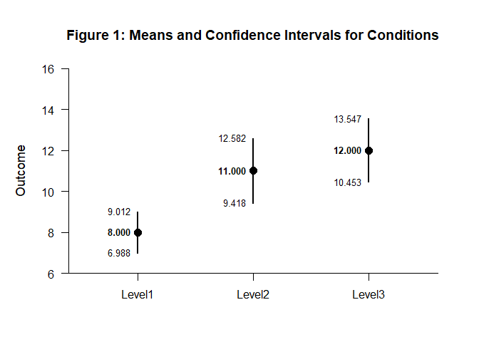
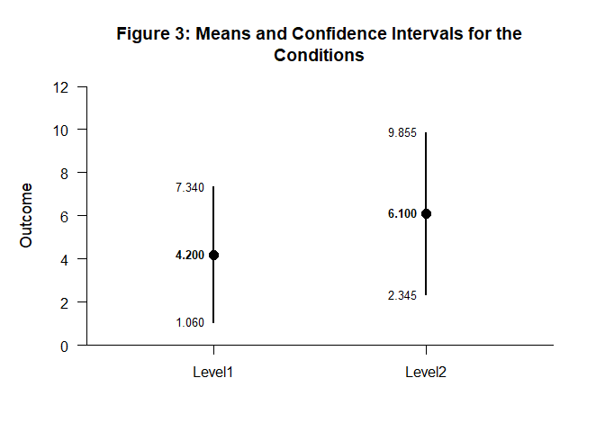
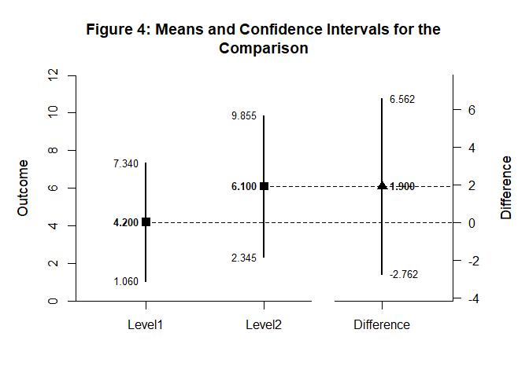

# [`DEVISE`](https://github.com/cwendorf/DEVISE/)

## Mean Comparisons with `backcalc`

This vignette demonstrates a mean comparison workflow using `backcalc`
to derive summary statistics and `DEVISE` to format and plot the
results. In each case, the steps progress from computing condition
intervals to a final comparison.

- [Case 1: Calculate Confidence Intervals from Summary
  Statistics](#case-1:-calculate-confidence-intervals-from-summary-statistics)
  - [Examine the Conditions](#examine-the-conditions)
  - [Display the Conditions](#display-the-conditions)
  - [Examine a Comparison](#examine-a-comparison)
  - [Display a Comparison](#display-a-comparison)
- [Case 2: Reconstruct Confidence Intervals from t
  Tests](#case-2:-reconstruct-confidence-intervals-from-t-tests)
  - [Examine the Conditions](#examine-the-conditions)
  - [Display the Conditions](#display-the-conditions)
  - [Examine a Comparison](#examine-a-comparison)
  - [Display a Comparison](#display-a-comparison)

------------------------------------------------------------------------

### Case 1: Calculate Confidence Intervals from Summary Statistics

#### Examine the Conditions

Use backcalc to compute confidence intervals for each condition from
summary statistics.

``` r
backcalc_means(m = 8.000, sd = 1.414, n = 10) |> extract_intervals() -> Level1
backcalc_means(m = 11.000, sd = 2.211, n = 10) |> extract_intervals() -> Level2
backcalc_means(m = 12.000, sd = 2.162, n = 10) |> extract_intervals() -> Level3

rbind(Level1, Level2, Level3) -> Conditions
c("Level1", "Level2", "Level3") -> rownames(Conditions)
```

#### Display the Conditions

Format and visualize the condition intervals.

``` r
Conditions |> style_matrix(title = "Table 1: Means and Confidence Intervals for Conditions", style = "apa")
```


    Table 1: Means and Confidence Intervals for Conditions 

    --------------------------------------- 
             Estimate         LL         UL 
    --------------------------------------- 
    Level1      8.000      6.988      9.012
    Level2     11.000      9.418     12.582
    Level3     12.000     10.453     13.547 
    --------------------------------------- 

``` r
Conditions |> plot_conditions(title = "Figure 1: Means and Confidence Intervals for Conditions", values = TRUE)
```

<!-- -->

#### Examine a Comparison

Compute the comparison interval between the two selected conditions.

``` r
backcalc_means(m = c(11.000, 8.000), sd = c(2.211, 1.414), n = c(10, 10)) |> extract_intervals() -> Difference

rbind(Level1, Level2, Difference) -> Comparison
c("Level1", "Level2", "Difference") -> rownames(Comparison)
```

#### Display a Comparison

Present the comparison in a formatted table and plot.

``` r
Comparison |> style_matrix(title = "Table 2: Means and Confidence Intervals for a Comparison", style = "apa")
```


    Table 2: Means and Confidence Intervals for a Comparison 

    ------------------------------------------- 
                 Estimate         LL         UL 
    ------------------------------------------- 
    Level1          8.000      6.988      9.012
    Level2         11.000      9.418     12.582
    Difference      3.000      1.234      4.766 
    ------------------------------------------- 

``` r
Comparison |> plot_comparison(title = "Figure 2: Means and Confidence Intervals for a Comparison", values = TRUE)
```

<!-- -->

### Case 2: Reconstruct Confidence Intervals from t Tests

#### Examine the Conditions

Suppose a study reports two one-sample t tests against zero for two
conditions but does not report confidence intervals. The study reports
means and the resulting test statistics and degrees of freedom.

``` r
backcalc_means(m = 4.20, statistic = 2.80, df = 19) |> extract_intervals() -> Level1
backcalc_means(m = 6.10, statistic = 3.40, df = 19) |> extract_intervals() -> Level2

rbind(Level1, Level2) -> Conditions
c("Level1", "Level2") -> rownames(Conditions)
```

#### Display the Conditions

Format and visualize the condition intervals.

``` r
Conditions |> style_matrix(title = "Table 3: Means and Confidence Intervals for the Conditions", style = "apa")
```


    Table 3: Means and Confidence Intervals for the Conditions 

    --------------------------------------- 
             Estimate         LL         UL 
    --------------------------------------- 
    Level1      4.200      1.060      7.340
    Level2      6.100      2.345      9.855 
    --------------------------------------- 

``` r
Conditions |> plot_conditions(title = "Figure 3: Means and Confidence Intervals for the Conditions", values = TRUE)
```

<!-- -->

#### Examine a Comparison

To reconstruct the confidence interval for the difference between the
two means, we use the statistics from the comparison.

``` r
backcalc_means(m = c(6.10, 4.20), statistic = 0.825, df = 38) |> extract_intervals() -> Difference

rbind(Level1, Level2, Difference) -> Comparison
c("Level1", "Level2", "Difference") -> rownames(Comparison)
```

#### Display a Comparison

Present the comparison in a formatted table and plot.

``` r
Comparison |> style_matrix(title = "Table 4: Means and Confidence Intervals for the Comparison", style = "apa")
```


    Table 4: Means and Confidence Intervals for the Comparison 

    ------------------------------------------- 
                 Estimate         LL         UL 
    ------------------------------------------- 
    Level1          4.200      1.060      7.340
    Level2          6.100      2.345      9.855
    Difference      1.900     -2.762      6.562 
    ------------------------------------------- 

``` r
Comparison |> plot_comparison(title = "Figure 4: Means and Confidence Intervals for the Comparison", values = TRUE)
```

<!-- -->
