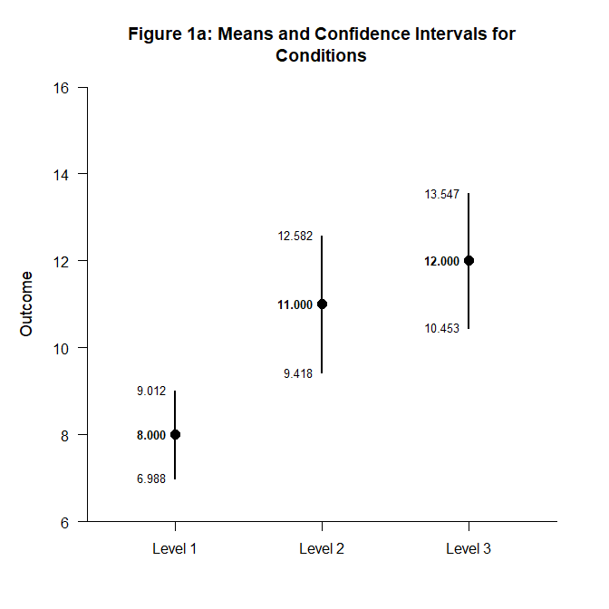
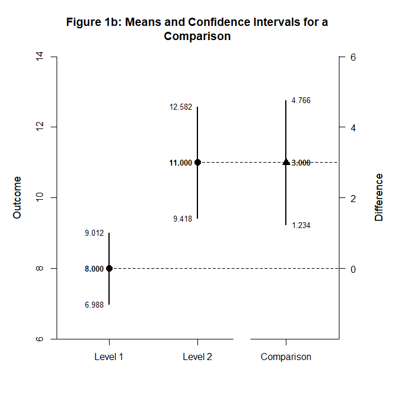
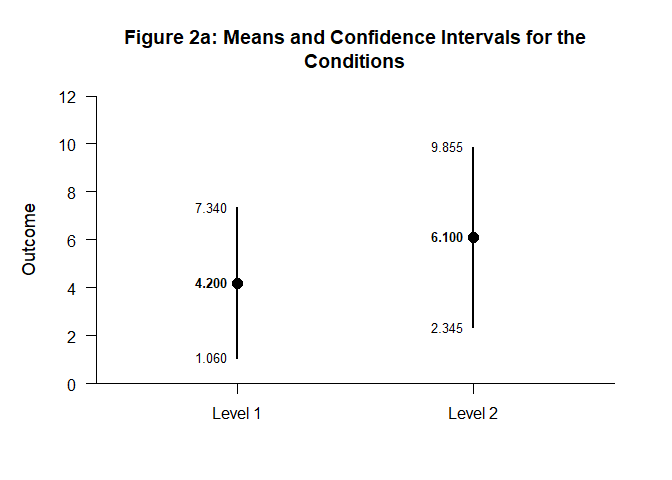
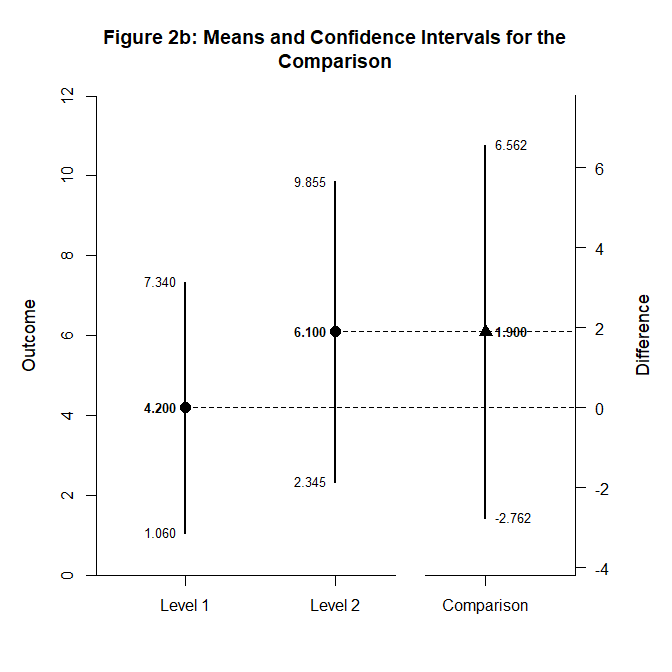

# [`DEVISE`](https://github.com/cwendorf/DEVISE/)

## Mean Comparisons with `backcalc`

This vignette demonstrates a mean comparison workflow using `backcalc`
to derive summary statistics and `DEVISE` to format and plot the
results. In each case, the steps progress from computing condition
intervals to a final comparison.

- [Calculate Confidence Intervals from Summary Statistics](#calculate-confidence-intervals-from-summary-statistics)
- [Reconstruct Confidence Intervals from t Tests](#reconstruct-confidence-intervals-from-t-tests)

------------------------------------------------------------------------

### Calculate Confidence Intervals from Summary Statistics

Use backcalc to compute confidence intervals for each condition from
summary statistics.

``` r
backcalc_means(m = 8.000, sd = 1.414, n = 10) |> extract_intervals() -> Level1
backcalc_means(m = 11.000, sd = 2.211, n = 10) |> extract_intervals() -> Level2
backcalc_means(m = 12.000, sd = 2.162, n = 10) |> extract_intervals() -> Level3
rbind(Level1, Level2, Level3) |> name_rows(c("Level 1", "Level 2", "Level 3")) -> Conditions
```

Format and visualize the condition intervals.

``` r
Conditions |> style_matrix(title = "Table 1a: Means and Confidence Intervals for Conditions")
```


    Table 1a: Means and Confidence Intervals for Conditions 

              Estimate         LL         UL
    Level 1      8.000      6.988      9.012
    Level 2     11.000      9.418     12.582
    Level 3     12.000     10.453     13.547

``` r
Conditions |> plot_conditions(title = "Figure 1a: Means and Confidence Intervals for Conditions")
```

<!-- -->

Compute the comparison interval between the two selected conditions.

``` r
backcalc_means(m = c(11.000, 8.000), sd = c(2.211, 1.414), n = c(10, 10)) |> extract_intervals() -> Difference
rbind(Level1, Level2, Difference) |> name_rows(c("Level 1", "Level 2", "Comparison")) -> Comparison
```

Present the comparison in a formatted table and plot.

``` r
Comparison |> style_matrix(title = "Table 1b: Means and Confidence Intervals for a Comparison")
```


    Table 1b: Means and Confidence Intervals for a Comparison 

                 Estimate         LL         UL
    Level 1         8.000      6.988      9.012
    Level 2        11.000      9.418     12.582
    Comparison      3.000      1.234      4.766

``` r
Comparison |> plot_comparison(title = "Figure 1b: Means and Confidence Intervals for a Comparison")
```

<!-- -->

### Reconstruct Confidence Intervals from t Tests

Suppose a study reports two one-sample t tests against zero for two
conditions but does not report confidence intervals. The study reports
means and the resulting test statistics and degrees of freedom.

``` r
backcalc_means(m = 4.20, statistic = 2.80, df = 19) |> extract_intervals() -> Level1
backcalc_means(m = 6.10, statistic = 3.40, df = 19) |> extract_intervals() -> Level2
rbind(Level1, Level2) |> name_rows(c("Level 1", "Level 2")) -> Conditions
```

Format and visualize the condition intervals.

``` r
Conditions |> style_matrix(title = "Table 2a: Means and Confidence Intervals for the Conditions")
```


    Table 2a: Means and Confidence Intervals for the Conditions 

              Estimate         LL         UL
    Level 1      4.200      1.060      7.340
    Level 2      6.100      2.345      9.855

``` r
Conditions |> plot_conditions(title = "Figure 2a: Means and Confidence Intervals for the Conditions")
```

<!-- -->

To reconstruct the confidence interval for the difference between the
two means, we use the statistics from the comparison.

``` r
backcalc_means(m = c(6.10, 4.20), statistic = 0.825, df = 38) |> extract_intervals() -> Difference
rbind(Level1, Level2, Difference) |> name_rows(c("Level 1", "Level 2", "Comparison")) -> Comparison
```

Present the comparison in a formatted table and plot.

``` r
Comparison |> style_matrix(title = "Table 2b: Means and Confidence Intervals for the Comparison")
```


    Table 2b: Means and Confidence Intervals for the Comparison 

                 Estimate         LL         UL
    Level 1         4.200      1.060      7.340
    Level 2         6.100      2.345      9.855
    Comparison      1.900     -2.762      6.562

``` r
Comparison |> plot_comparison(title = "Figure 2b: Means and Confidence Intervals for the Comparison")
```

<!-- -->
