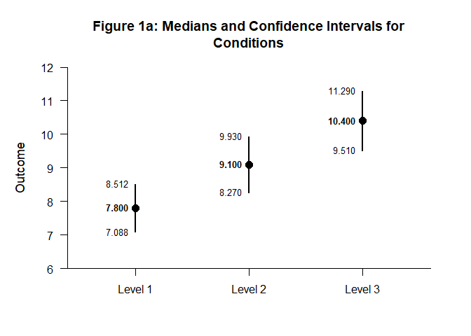
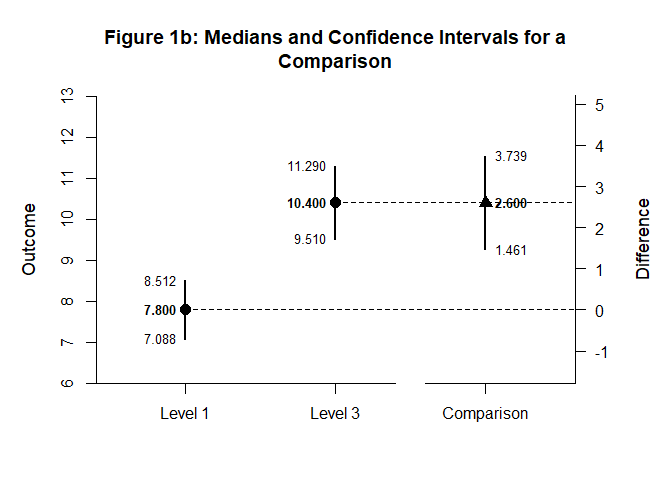
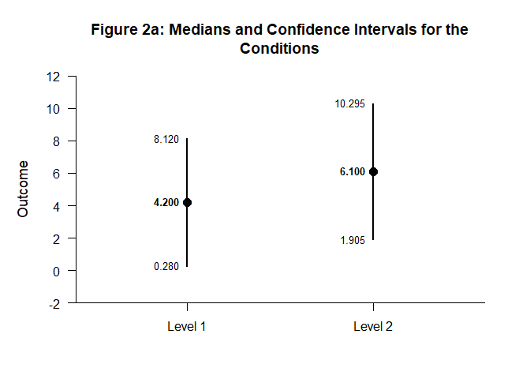
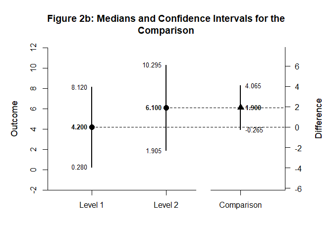

# [`DEVISE`](https://github.com/cwendorf/DEVISE/)

## Median Comparisons with `backcalc`

This vignette demonstrates a median comparison workflow using `backcalc`
to derive interval estimates and `DEVISE` to format and plot the
results.

- [Calculate Confidence Intervals from Medians, IQRs, and Sample Sizes](#calculate-confidence-intervals-from-medians,-iqrs,-and-sample-sizes)
- [Reconstruct Confidence Intervals from Rank-Test Statistics](#reconstruct-confidence-intervals-from-rank-test-statistics)

------------------------------------------------------------------------

### Calculate Confidence Intervals from Medians, IQRs, and Sample Sizes

Use backcalc to compute confidence intervals for each condition from
median-based summary statistics.

``` r
backcalc_medians(mdn = 7.800, iqr = 2.400, n = 24) |> extract_intervals() -> Level1
backcalc_medians(mdn = 9.100, iqr = 2.800, n = 24) |> extract_intervals() -> Level2
backcalc_medians(mdn = 10.400, iqr = 3.000, n = 24) |> extract_intervals() -> Level3
rbind(Level1, Level2, Level3) |> name_rows(c("Level 1", "Level 2", "Level 3")) -> Conditions
```

Format and visualize the condition intervals.

``` r
Conditions |> style_matrix(title = "Table 1a: Medians and Confidence Intervals for Conditions")
```


    Table 1a: Medians and Confidence Intervals for Conditions 

    ---------------------------------------- 
              Estimate         LL         UL 
    ---------------------------------------- 
    Level 1      7.800      7.088      8.512
    Level 2      9.100      8.270      9.930
    Level 3     10.400      9.510     11.290 
    ---------------------------------------- 

``` r
Conditions |> plot_conditions(title = "Figure 1a: Medians and Confidence Intervals for Conditions")
```

<!-- -->

Compute the comparison interval between two selected conditions.

``` r
backcalc_medians(mdn = c(10.400, 7.800), iqr = c(3.000, 2.400), n = c(24, 24)) |> extract_intervals() -> Difference
rbind(Level1, Level3, Difference) |> name_rows(c("Level 1", "Level 3", "Comparison")) -> Comparison
```

Present the comparison in a formatted table and plot.

``` r
Comparison |> style_matrix(title = "Table 1b: Medians and Confidence Intervals for a Comparison")
```


    Table 1b: Medians and Confidence Intervals for a Comparison 

    ------------------------------------------- 
                 Estimate         LL         UL 
    ------------------------------------------- 
    Level 1         7.800      7.088      8.512
    Level 3        10.400      9.510     11.290
    Comparison      2.600      1.461      3.739 
    ------------------------------------------- 

``` r
Comparison |> plot_comparison(title = "Figure 1b: Medians and Confidence Intervals for a Comparison")
```

<!-- -->

### Reconstruct Confidence Intervals from Rank-Test Statistics

Suppose a study reports two one-sample rank-test statistics against zero
for two conditions but does not report confidence intervals. The study
reports medians and resulting z statistics.

``` r
backcalc_medians(mdn = 4.20, statistic = 2.10) |> extract_intervals() -> Level1
backcalc_medians(mdn = 6.10, statistic = 2.85) |> extract_intervals() -> Level2
rbind(Level1, Level2) |> name_rows(c("Level 1", "Level 2")) -> Conditions
```

Format and visualize the condition intervals.

``` r
Conditions |> style_matrix(title = "Table 2a: Medians and Confidence Intervals for the Conditions")
```


    Table 2a: Medians and Confidence Intervals for the Conditions 

    ---------------------------------------- 
              Estimate         LL         UL 
    ---------------------------------------- 
    Level 1      4.200      0.280      8.120
    Level 2      6.100      1.905     10.295 
    ---------------------------------------- 

``` r
Conditions |> plot_conditions(title = "Figure 2a: Medians and Confidence Intervals for the Conditions")
```

<!-- -->

To reconstruct the confidence interval for the difference between the
two medians, use the z statistic from the comparison.

``` r
backcalc_medians(mdn = c(6.10, 4.20), statistic = 1.72) |> extract_intervals() -> Difference
rbind(Level1, Level2, Difference) |> name_rows(c("Level 1", "Level 2", "Comparison")) -> Comparison
```

Present the comparison in a formatted table and plot.

``` r
Comparison |> style_matrix(title = "Table 2b: Medians and Confidence Intervals for the Comparison")
```


    Table 2b: Medians and Confidence Intervals for the Comparison 

    ------------------------------------------- 
                 Estimate         LL         UL 
    ------------------------------------------- 
    Level 1         4.200      0.280      8.120
    Level 2         6.100      1.905     10.295
    Comparison      1.900     -0.265      4.065 
    ------------------------------------------- 

``` r
Comparison |> plot_comparison(title = "Figure 2b: Medians and Confidence Intervals for the Comparison")
```

<!-- -->
