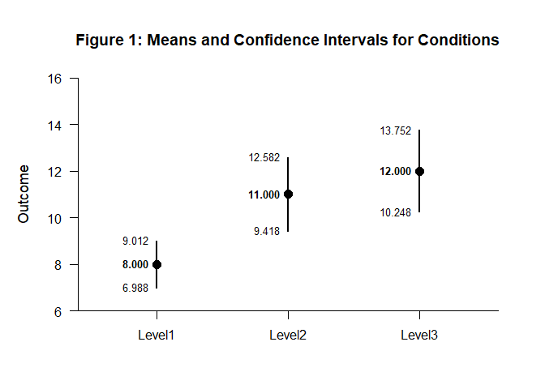

# [`DEVISE`](https://github.com/cwendorf/DEVISE/)

## Mean Comparisons with Base R

This vignette walks through a complete mean comparison workflow using
Base R for data entry and DEVISE for interval extraction and
visualization. Each step builds on the previous one, ending with a
comparison table and plot.

- [Case 1: Raw Data Input](#case-1:-raw-data-input)
  - [Input the Data](#input-the-data)
  - [Examine the Conditions](#examine-the-conditions)
  - [Display the Conditions](#display-the-conditions)
  - [Make a Comparison](#make-a-comparison)
  - [Examine a Comparison](#examine-a-comparison)
  - [Display a Comparison](#display-a-comparison)

------------------------------------------------------------------------

### Case 1: Raw Data Input

#### Input the Data

Create a simple factor and outcome vector that will be used to compute
condition-specific statistics.

``` r
gl(3, 10, labels = c("Level1", "Level2", "Level3")) -> Factor
c(6, 8, 6, 8, 10, 8, 10, 9, 8, 7, 7, 13, 11, 10, 13, 8, 11, 14, 12, 11, 9, 16, 11, 12, 15, 13, 9, 14, 11, 10) -> Outcome
```

#### Examine the Conditions

Compute confidence intervals for each level and assemble them into a
conditions matrix.

``` r
Outcome[Factor == "Level1"] |> t.test() |> extract_intervals() -> Level1
Outcome[Factor == "Level2"] |> t.test() |> extract_intervals() -> Level2
Outcome[Factor == "Level3"] |> t.test() |> extract_intervals() -> Level3

rbind(Level1, Level2, Level3) -> Conditions
c("Level1", "Level2", "Level3") -> rownames(Conditions)
```

#### Display the Conditions

Format the conditions matrix and visualize the confidence intervals.

``` r
Conditions |> style_matrix(title = "Table 1: Means and Confidence Intervals for Conditions", style = "apa")
```


    Table 1: Means and Confidence Intervals for Conditions 

    --------------------------------------- 
             Estimate         LL         UL 
    --------------------------------------- 
    Level1      8.000      6.988      9.012
    Level2     11.000      9.418     12.582
    Level3     12.000     10.248     13.752 
    --------------------------------------- 

``` r
Conditions |> plot_conditions(title = "Figure 1: Means and Confidence Intervals for Conditions", values = TRUE)
```

<!-- -->

#### Make a Comparison

Subset the data to the two conditions that will be compared directly.

``` r
Outcome[Factor %in% c("Level1", "Level2")] -> Outcome_Sub
Factor[Factor %in% c("Level1", "Level2")] -> Factor_Sub
```

#### Examine a Comparison

Compute the comparison interval between the two selected conditions.

``` r
(Outcome_Sub ~ Factor_Sub) |> t.test() |> extract_intervals() -> Difference

rbind(Level1, Level2, Difference) -> Comparison
c("Level1", "Level2", "Difference") -> rownames(Comparison)
```

#### Display a Comparison

Present the comparison in a formatted table and plot.

``` r
Comparison |> style_matrix(title = "Table 2: Means and Confidence Intervals for a Comparison", style = "apa")
```


    Table 2: Means and Confidence Intervals for a Comparison 

    ------------------------------------------- 
                 Estimate         LL         UL 
    ------------------------------------------- 
    Level1          8.000      6.988      9.012
    Level2         11.000      9.418     12.582
    Difference      3.000      1.234      4.766 
    ------------------------------------------- 

``` r
Comparison |> plot_comparison(title = "Figure 2: Means and Confidence Intervals for a Comparison", values = TRUE)
```

<!-- -->
