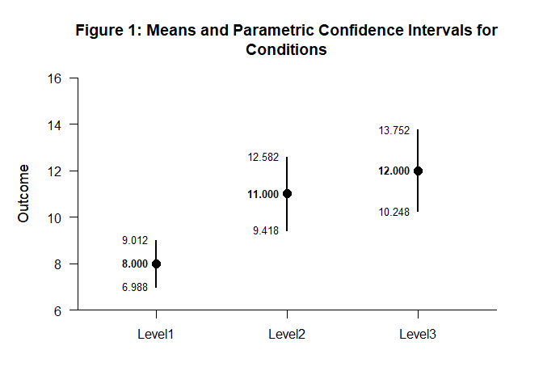
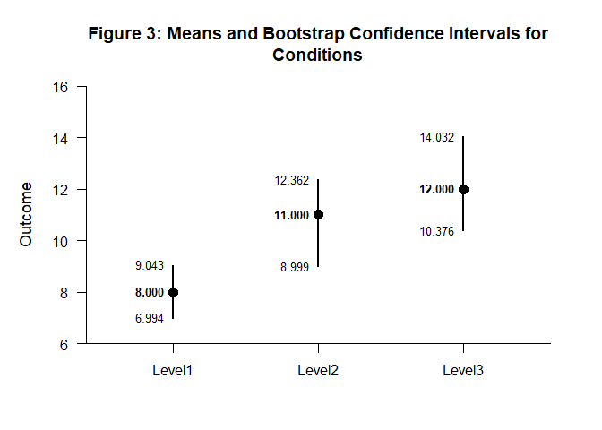
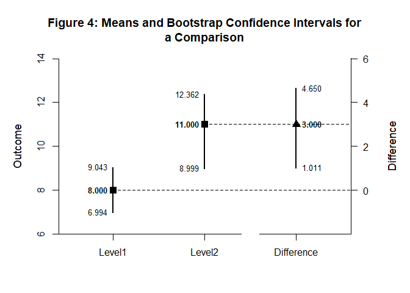

# [`DEVISE`](https://github.com/cwendorf/DEVISE/)

## Bootstrapped Intervals Vignette

In conjunction with `DEVISE`, this vignette demonstrates how to use the
`confintr` package for parametric and bootstrap confidence intervals.
`confintr` supports both distribution-based confidence intervals for
normally-distributed data and bootstrap methods that provide
distribution-free intervals without relying on parametric assumptions.

- [Case 1: Parametric Confidence Intervals](#case-1%3A-parametric-confidence-intervals) 
  - [Input the Data](#input-the-data)
  - [Examine the Conditions](#examine-the-conditions)
  - [Display the Conditions](#display-the-conditions)
  - [Examine a Comparison](#examine-a-comparison)
  - [Display a Comparison](#display-a-comparison)
- [Case 2: Bootstrap Confidence Intervals](#case-2%3A-bootstrap-confidence-intervals) 
  - [Examine the Conditions](#examine-the-conditions)
  - [Display the Conditions](#display-the-conditions)
  - [Examine a Comparison](#examine-a-comparison)
  - [Display a Comparison](#display-a-comparison)

------------------------------------------------------------------------

### Case 1: Parametric Confidence Intervals

#### Input the Data

Create a dataset for confidence interval analysis.

``` r
gl(3, 10, labels = c("Level1", "Level2", "Level3")) -> Factor
c(6, 8, 6, 8, 10, 8, 10, 9, 8, 7, 7, 13, 11, 10, 13, 8, 11, 14, 12, 11, 9, 16, 11, 12, 15, 13, 9, 14, 11, 10) -> Outcome

data.frame(Factor, Outcome) -> df
```

#### Examine the Conditions

Use `confintr` with the default parametric method for each condition.

``` r
ci_mean(df$Outcome[df$Factor == "Level1"]) |> extract_intervals() -> Level1_Param
ci_mean(df$Outcome[df$Factor == "Level2"]) |> extract_intervals() -> Level2_Param
ci_mean(df$Outcome[df$Factor == "Level3"]) |> extract_intervals() -> Level3_Param

rbind(Level1_Param, Level2_Param, Level3_Param) -> ParamConditions
c("Level1", "Level2", "Level3") -> rownames(ParamConditions)
```

#### Display the Conditions

Format and visualize the parametric confidence intervals.

``` r
ParamConditions |> style_matrix(title = "Table 1: Means and Parametric Confidence Intervals for Conditions", style = "apa")
```


    Table 1: Means and Parametric Confidence Intervals for Conditions 

    --------------------------------------- 
             Estimate         LL         UL 
    --------------------------------------- 
    Level1      8.000      6.988      9.012
    Level2     11.000      9.418     12.582
    Level3     12.000     10.248     13.752 
    --------------------------------------- 

``` r
ParamConditions |> plot_conditions(title = "Figure 1: Means and Parametric Confidence Intervals for Conditions", values = TRUE)
```

<!-- -->

#### Examine a Comparison

Use the parametric method to compare conditions.

``` r
ci_mean_diff(df$Outcome[df$Factor == "Level2"], 
             df$Outcome[df$Factor == "Level1"]) |> extract_intervals() -> Difference_Param

rbind(Level1_Param, Level2_Param, Difference_Param) -> ParamComparison
c("Level1", "Level2", "Difference") -> rownames(ParamComparison)
```

#### Display a Comparison

Present the parametric comparison results in tables and plots.

``` r
ParamComparison |> style_matrix(title = "Table 2: Means and Parametric Confidence Intervals for a Comparison", style = "apa")
```


    Table 2: Means and Parametric Confidence Intervals for a Comparison 

    ------------------------------------------- 
                 Estimate         LL         UL 
    ------------------------------------------- 
    Level1          8.000      6.988      9.012
    Level2         11.000      9.418     12.582
    Difference      3.000      1.234      4.766 
    ------------------------------------------- 

``` r
ParamComparison |> plot_comparison(title = "Figure 2: Means and Parametric Confidence Intervals for a Comparison", values = TRUE)
```

<!-- -->

### Case 2: Bootstrap Confidence Intervals

#### Examine the Conditions

Use `confintr` with bootstrap methods for each condition.

``` r
ci_mean(df$Outcome[df$Factor == "Level1"], type = "bootstrap", R = 10000) |> extract_intervals() -> Level1_Boot
ci_mean(df$Outcome[df$Factor == "Level2"], type = "bootstrap", R = 10000) |> extract_intervals() -> Level2_Boot
ci_mean(df$Outcome[df$Factor == "Level3"], type = "bootstrap", R = 10000) |> extract_intervals() -> Level3_Boot

rbind(Level1_Boot, Level2_Boot, Level3_Boot) -> BootConditions
c("Level1", "Level2", "Level3") -> rownames(BootConditions)
```

#### Display the Conditions

Format and visualize the bootstrap confidence intervals.

``` r
BootConditions |> style_matrix(title = "Table 3: Means and Bootstrap Confidence Intervals for Conditions", style = "apa")
```


    Table 3: Means and Bootstrap Confidence Intervals for Conditions 

    --------------------------------------- 
             Estimate         LL         UL 
    --------------------------------------- 
    Level1      8.000      6.994      9.043
    Level2     11.000      8.999     12.362
    Level3     12.000     10.376     14.032 
    --------------------------------------- 

``` r
BootConditions |> plot_conditions(title = "Figure 3: Means and Bootstrap Confidence Intervals for Conditions", values = TRUE)
```

<!-- -->

#### Examine a Comparison

Use the bootstrap method to compare conditions.

``` r
ci_mean_diff(df$Outcome[df$Factor == "Level2"], 
             df$Outcome[df$Factor == "Level1"], 
             type = "bootstrap", 
             R = 10000) |> extract_intervals() -> Difference_Boot

rbind(Level1_Boot, Level2_Boot, Difference_Boot) -> BootComparison
c("Level1", "Level2", "Difference") -> rownames(BootComparison)
```

#### Display a Comparison

Present the bootstrap comparison results in tables and plots.

``` r
BootComparison |> style_matrix(title = "Table 4: Means and Bootstrap Confidence Intervals for a Comparison", style = "apa")
```


    Table 4: Means and Bootstrap Confidence Intervals for a Comparison 

    ------------------------------------------- 
                 Estimate         LL         UL 
    ------------------------------------------- 
    Level1          8.000      6.994      9.043
    Level2         11.000      8.999     12.362
    Difference      3.000      1.011      4.650 
    ------------------------------------------- 

``` r
BootComparison |> plot_comparison(title = "Figure 4: Means and Bootstrap Confidence Intervals for a Comparison", values = TRUE)
```

<!-- -->
