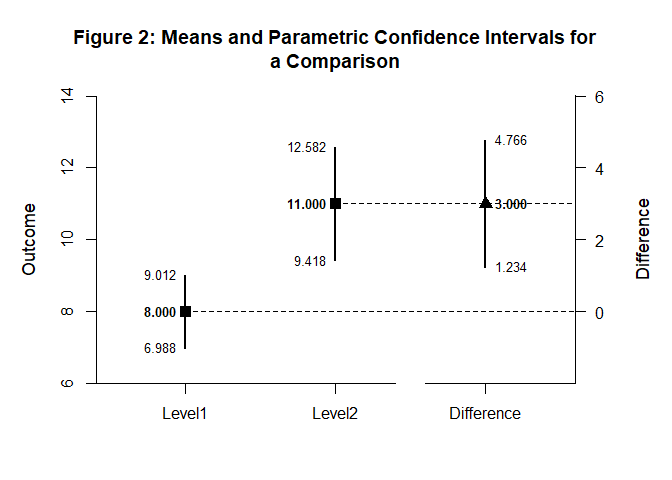
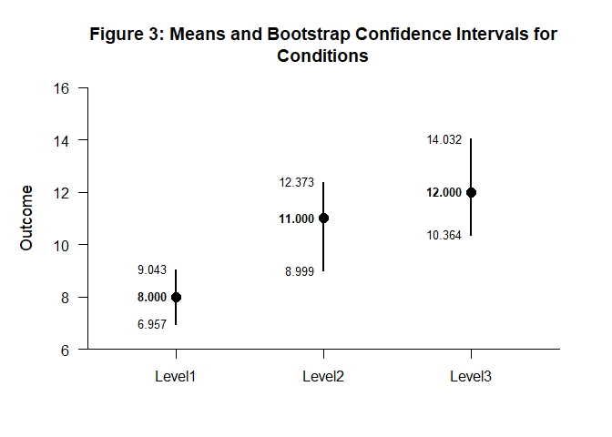
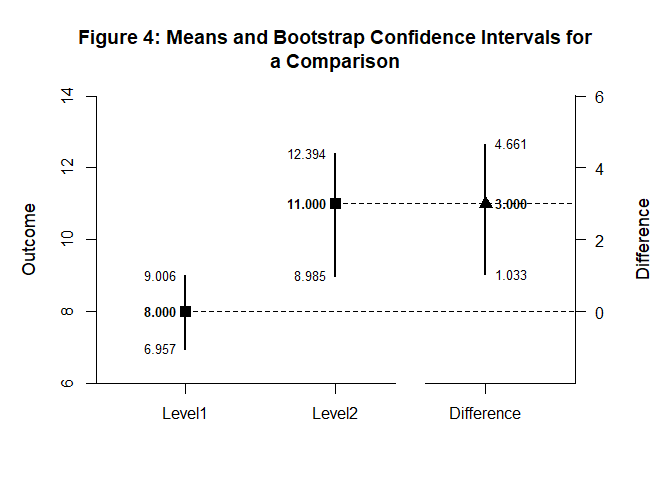

# [`DEVISE`](https://github.com/cwendorf/DEVISE/)

## Mean Comparisons with `confintr`

This vignette illustrates a mean comparison workflow using the confintr
package to compute intervals and `DEVISE` to format and plot results. The
steps move from condition intervals to the final comparison display.

- [Case 1: Parametric Confidence Intervals](#case-1-parametric-confidence-intervals)
- [Case 2: Bootstrap Confidence Intervals](#case-2-bootstrap-confidence-intervals)

------------------------------------------------------------------------

### Case 1: Parametric Confidence Intervals

#### Input the Data

Create a dataset for confidence interval analysis.

``` r
gl(3, 10, labels = c("Level1", "Level2", "Level3")) -> Factor
c(6, 8, 6, 8, 10, 8, 10, 9, 8, 7, 7, 13, 11, 10, 13, 8, 11, 14, 12, 11, 9, 16, 11, 12, 15, 13, 9, 14, 11, 10) -> Outcome
data.frame(Factor, Outcome) -> df
```

#### Examine the Conditions

Use `confintr` with the default parametric method for each condition.

``` r
df |> use_vars(Outcome[Factor == "Level1"]) |> ci_mean() |> extract_intervals() -> Level1
df |> use_vars(Outcome[Factor == "Level2"]) |> ci_mean() |> extract_intervals() -> Level2
df |> use_vars(Outcome[Factor == "Level3"]) |> ci_mean() |> extract_intervals() -> Level3
rbind(Level1, Level2, Level3) |> name_rows(c("Level1", "Level2", "Level3")) -> Conditions
```

#### Display the Conditions

Format and visualize the parametric confidence intervals.

``` r
Conditions |> style_matrix(title = "Table 1: Means and Parametric Confidence Intervals for Conditions", style = "apa")
```


    Table 1: Means and Parametric Confidence Intervals for Conditions 

    --------------------------------------- 
             Estimate         LL         UL 
    --------------------------------------- 
    Level1      8.000      6.988      9.012
    Level2     11.000      9.418     12.582
    Level3     12.000     10.248     13.752 
    --------------------------------------- 

``` r
Conditions |> plot_conditions(title = "Figure 1: Means and Parametric Confidence Intervals for Conditions", values = TRUE)
```

<!-- -->

#### Examine a Comparison

Use the parametric method to compare conditions.

``` r
ci_mean_diff(df$Outcome[df$Factor == "Level2"], 
             df$Outcome[df$Factor == "Level1"]) |> extract_intervals() -> Difference
rbind(Level1, Level2, Difference) |> name_rows(c("Level1", "Level2", "Difference")) -> Comparison
```

#### Display a Comparison

Present the parametric comparison results in tables and plots.

``` r
Comparison |> style_matrix(title = "Table 2: Means and Parametric Confidence Intervals for a Comparison", style = "apa")
```


    Table 2: Means and Parametric Confidence Intervals for a Comparison 

    ------------------------------------------- 
                 Estimate         LL         UL 
    ------------------------------------------- 
    Level1          8.000      6.988      9.012
    Level2         11.000      9.418     12.582
    Difference      3.000      1.234      4.766 
    ------------------------------------------- 

``` r
Comparison |> plot_comparison(title = "Figure 2: Means and Parametric Confidence Intervals for a Comparison", values = TRUE)
```

<!-- -->

### Case 2: Bootstrap Confidence Intervals

#### Examine the Conditions

Use `confintr` with bootstrap methods for each condition.

``` r
df |> use_vars(Outcome[Factor == "Level1"]) |> ci_mean(type = "bootstrap", R = 10000) |> extract_intervals() -> Level1
df |> use_vars(Outcome[Factor == "Level2"]) |> ci_mean(type = "bootstrap", R = 10000) |> extract_intervals() -> Level2
df |> use_vars(Outcome[Factor == "Level3"]) |> ci_mean(type = "bootstrap", R = 10000) |> extract_intervals() -> Level3
rbind(Level1, Level2, Level3) |> name_rows(c("Level1", "Level2", "Level3")) -> Conditions
```

#### Display the Conditions

Format and visualize the bootstrap confidence intervals.

``` r
Conditions |> style_matrix(title = "Table 3: Means and Bootstrap Confidence Intervals for Conditions", style = "apa")
```


    Table 3: Means and Bootstrap Confidence Intervals for Conditions 

    --------------------------------------- 
             Estimate         LL         UL 
    --------------------------------------- 
    Level1      8.000      6.957      9.006
    Level2     11.000      8.985     12.394
    Level3     12.000     10.364     13.996 
    --------------------------------------- 

``` r
Conditions |> plot_conditions(title = "Figure 3: Means and Bootstrap Confidence Intervals for Conditions", values = TRUE)
```

<!-- -->

#### Examine a Comparison

Use the bootstrap method to compare conditions.

``` r
ci_mean_diff(df$Outcome[df$Factor == "Level2"], 
             df$Outcome[df$Factor == "Level1"], 
             type = "bootstrap", 
             R = 10000) |> extract_intervals() -> Difference
rbind(Level1, Level2, Difference) |> name_rows(c("Level1", "Level2", "Difference")) -> Comparison
```

#### Display a Comparison

Present the bootstrap comparison results in tables and plots.

``` r
Comparison |> style_matrix(title = "Table 4: Means and Bootstrap Confidence Intervals for a Comparison", style = "apa")
```


    Table 4: Means and Bootstrap Confidence Intervals for a Comparison 

    ------------------------------------------- 
                 Estimate         LL         UL 
    ------------------------------------------- 
    Level1          8.000      6.957      9.006
    Level2         11.000      8.985     12.394
    Difference      3.000      1.033      4.661 
    ------------------------------------------- 

``` r
Comparison |> plot_comparison(title = "Figure 4: Means and Bootstrap Confidence Intervals for a Comparison", values = TRUE)
```

<!-- -->
