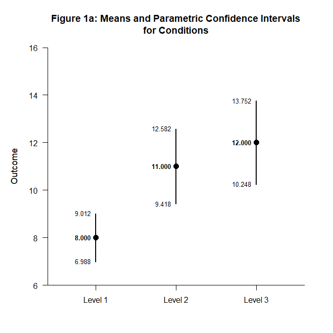
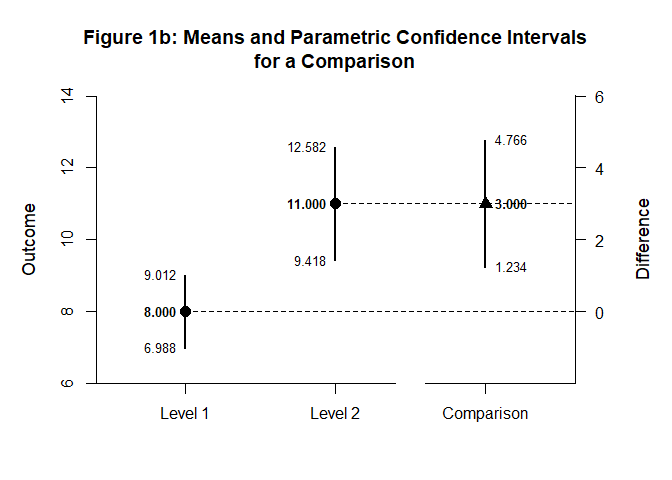
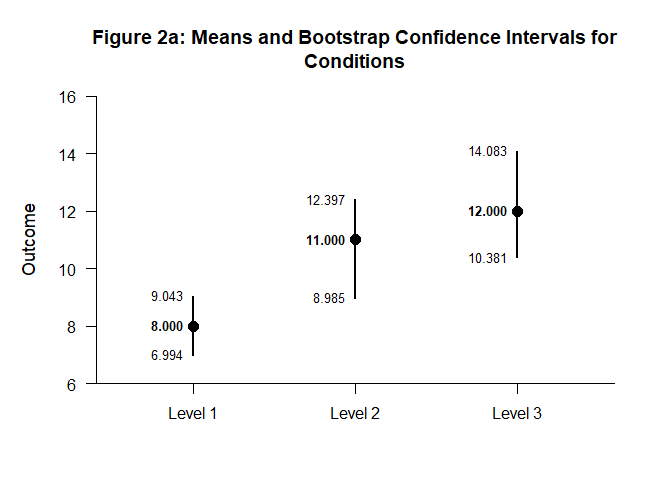
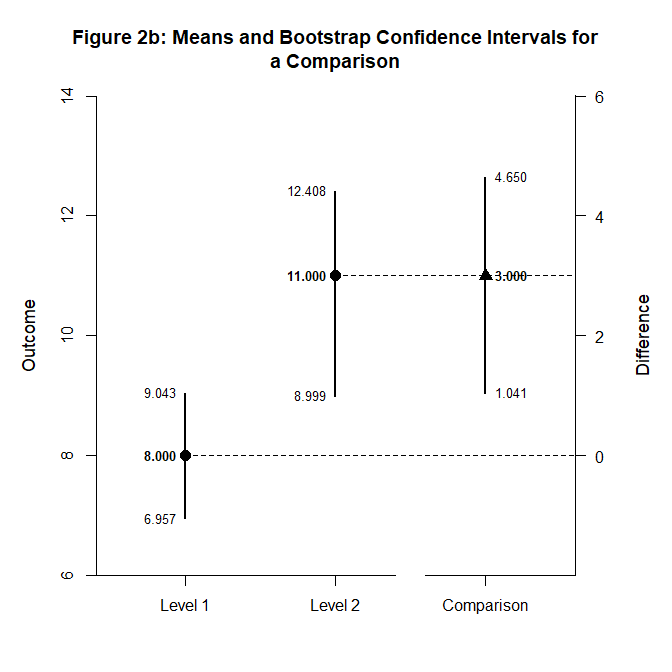

# [`DEVISE`](https://github.com/cwendorf/DEVISE/)

## Mean Comparisons with `confintr`

This vignette illustrates a mean comparison workflow using the confintr
package to compute intervals and `DEVISE` to format and plot results.
The steps move from condition intervals to the final comparison display.

- [Parametric Confidence Intervals](#parametric-confidence-intervals)
- [Bootstrap Confidence Intervals](#bootstrap-confidence-intervals)

------------------------------------------------------------------------

### Parametric Confidence Intervals

Create a dataset for confidence interval analysis.

``` r
gl(3, 10, labels = c("Level1", "Level2", "Level3")) -> Factor
c(6, 8, 6, 8, 10, 8, 10, 9, 8, 7, 7, 13, 11, 10, 13, 8, 11, 14, 12, 11, 9, 16, 11, 12, 15, 13, 9, 14, 11, 10) -> Outcome
data.frame(Factor, Outcome) -> df
```

Use `confintr` with the default parametric method for each condition.

``` r
df |> use_vars(Outcome[Factor == "Level1"]) |> ci_mean() |> extract_intervals() -> Level1
df |> use_vars(Outcome[Factor == "Level2"]) |> ci_mean() |> extract_intervals() -> Level2
df |> use_vars(Outcome[Factor == "Level3"]) |> ci_mean() |> extract_intervals() -> Level3
rbind(Level1, Level2, Level3) |> name_rows(c("Level 1", "Level 2", "Level 3")) -> Conditions
```

Format and visualize the parametric confidence intervals.

``` r
Conditions |> style_matrix(title = "Table 1a: Means and Parametric Confidence Intervals for Conditions")
```


    Table 1a: Means and Parametric Confidence Intervals for Conditions 

    ---------------------------------------- 
              Estimate         LL         UL 
    ---------------------------------------- 
    Level 1      8.000      6.988      9.012
    Level 2     11.000      9.418     12.582
    Level 3     12.000     10.248     13.752 
    ---------------------------------------- 

``` r
Conditions |> plot_conditions(title = "Figure 1a: Means and Parametric Confidence Intervals for Conditions")
```

<!-- -->

Use the parametric method to compare conditions.

``` r
ci_mean_diff(df$Outcome[df$Factor == "Level2"], df$Outcome[df$Factor == "Level1"]) |> extract_intervals() -> Difference
rbind(Level1, Level2, Difference) |> name_rows(c("Level 1", "Level 2", "Comparison")) -> Comparison
```

Present the parametric comparison results in tables and plots.

``` r
Comparison |> style_matrix(title = "Table 1b: Means and Parametric Confidence Intervals for a Comparison")
```


    Table 1b: Means and Parametric Confidence Intervals for a Comparison 

    ------------------------------------------- 
                 Estimate         LL         UL 
    ------------------------------------------- 
    Level 1         8.000      6.988      9.012
    Level 2        11.000      9.418     12.582
    Comparison      3.000      1.234      4.766 
    ------------------------------------------- 

``` r
Comparison |> plot_comparison(title = "Figure 1b: Means and Parametric Confidence Intervals for a Comparison")
```

<!-- -->

### Bootstrap Confidence Intervals

Use `confintr` with bootstrap methods for each condition.

``` r
df |> use_vars(Outcome[Factor == "Level1"]) |> ci_mean(type = "bootstrap", R = 10000) |> extract_intervals() -> Level1
df |> use_vars(Outcome[Factor == "Level2"]) |> ci_mean(type = "bootstrap", R = 10000) |> extract_intervals() -> Level2
df |> use_vars(Outcome[Factor == "Level3"]) |> ci_mean(type = "bootstrap", R = 10000) |> extract_intervals() -> Level3
rbind(Level1, Level2, Level3) |> name_rows(c("Level 1", "Level 2", "Level 3")) -> Conditions
```

Format and visualize the bootstrap confidence intervals.

``` r
Conditions |> style_matrix(title = "Table 2a: Means and Bootstrap Confidence Intervals for Conditions")
```


    Table 2a: Means and Bootstrap Confidence Intervals for Conditions 

    ---------------------------------------- 
              Estimate         LL         UL 
    ---------------------------------------- 
    Level 1      8.000      6.994      9.006
    Level 2     11.000      8.968     12.373
    Level 3     12.000     10.321     14.032 
    ---------------------------------------- 

``` r
Conditions |> plot_conditions(title = "Figure 2a: Means and Bootstrap Confidence Intervals for Conditions")
```

<!-- -->

Use the bootstrap method to compare conditions.

``` r
ci_mean_diff(df$Outcome[df$Factor == "Level2"], df$Outcome[df$Factor == "Level1"], type = "bootstrap", R = 10000) |> extract_intervals() -> Difference
rbind(Level1, Level2, Difference) |> name_rows(c("Level 1", "Level 2", "Comparison")) -> Comparison
```

Present the bootstrap comparison results in tables and plots.

``` r
Comparison |> style_matrix(title = "Table 2b: Means and Bootstrap Confidence Intervals for a Comparison")
```


    Table 2b: Means and Bootstrap Confidence Intervals for a Comparison 

    ------------------------------------------- 
                 Estimate         LL         UL 
    ------------------------------------------- 
    Level 1         8.000      6.994      9.006
    Level 2        11.000      8.968     12.373
    Comparison      3.000      1.041      4.622 
    ------------------------------------------- 

``` r
Comparison |> plot_comparison(title = "Figure 2b: Means and Bootstrap Confidence Intervals for a Comparison")
```

<!-- -->
