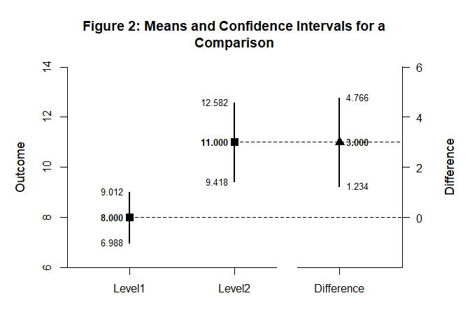
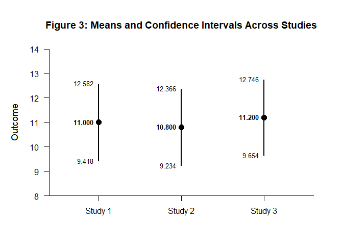

# [`DEVISE`](https://github.com/cwendorf/DEVISE/)

## Mean Comparisons with Direct Input

This vignette shows how to supply confidence interval inputs directly
and use `DEVISE` to assemble, format, and visualize conditions and
comparisons.

- [Estimates from a Single Source](#estimates-from-a-single-source)
- [Estimates from Multiple Studies](#estimates-from-multiple-studies)

------------------------------------------------------------------------

### Estimates from a Single Source

When working with published studies or secondary data sources, you can
directly input the reported estimates and confidence intervals. This
approach is useful for meta-analyses, literature reviews, or when
reconstructing results from research reports.

``` r
c(Estimate = 8.000, LL = 6.988, UL = 9.012) -> Level1
c(Estimate = 11.000, LL = 9.418, UL = 12.582) -> Level2
c(Estimate = 12.000, LL = 10.248, UL = 13.752) -> Level3
rbind(Level1, Level2, Level3) |> name_rows(c("Level1", "Level2", "Level3")) -> Conditions
```

Format the condition matrix and visualize the intervals.

``` r
Conditions |> style_matrix(title = "Table 1: Means and Confidence Intervals for Conditions", style = "apa")
```


    Table 1: Means and Confidence Intervals for Conditions 

    --------------------------------------- 
             Estimate         LL         UL 
    --------------------------------------- 
    Level1      8.000      6.988      9.012
    Level2     11.000      9.418     12.582
    Level3     12.000     10.248     13.752 
    --------------------------------------- 

``` r
Conditions |> plot_conditions(title = "Figure 1: Means and Confidence Intervals for Conditions", values = TRUE)
```

<!-- -->

Enter the comparison statistics for the selected conditions.

``` r
c(Estimate = 3.000, LL = 1.234, UL = 4.766) -> Difference
rbind(Level1, Level2, Difference) |> name_rows(c("Level1", "Level2", "Difference")) -> Comparison
```

Present the comparison in a formatted table and plot.

``` r
Comparison |> style_matrix(title = "Table 2: Means and Confidence Intervals for a Comparison", style = "apa")
```


    Table 2: Means and Confidence Intervals for a Comparison 

    ------------------------------------------- 
                 Estimate         LL         UL 
    ------------------------------------------- 
    Level1          8.000      6.988      9.012
    Level2         11.000      9.418     12.582
    Difference      3.000      1.234      4.766 
    ------------------------------------------- 

``` r
Comparison |> plot_comparison(title = "Figure 2: Means and Confidence Intervals for a Comparison", values = TRUE)
```

<!-- -->

### Estimates from Multiple Studies

When synthesizing results from multiple publications, `DEVISE` makes it
easy to organize and present findings from different sources.

``` r
c(Estimate = 11.000, LL = 9.418, UL = 12.582) -> Study1
c(Estimate = 10.800, LL = 9.234, UL = 12.366) -> Study2
c(Estimate = 11.200, LL = 9.654, UL = 12.746) -> Study3
rbind(Study1, Study2, Study3) |> name_rows(c("Study 1", "Study 2", "Study 3")) -> Studies
```

Format and visualize results from multiple sources for comparison.

``` r
Studies |> style_matrix(title = "Table 3: Means and Confidence Intervals Across Studies", style = "apa")
```


    Table 3: Means and Confidence Intervals Across Studies 

    ---------------------------------------- 
              Estimate         LL         UL 
    ---------------------------------------- 
    Study 1     11.000      9.418     12.582
    Study 2     10.800      9.234     12.366
    Study 3     11.200      9.654     12.746 
    ---------------------------------------- 

``` r
Studies |> plot_conditions(title = "Figure 3: Means and Confidence Intervals Across Studies", values = TRUE)
```

<!-- -->
