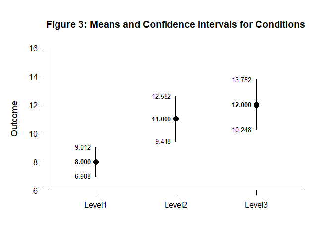
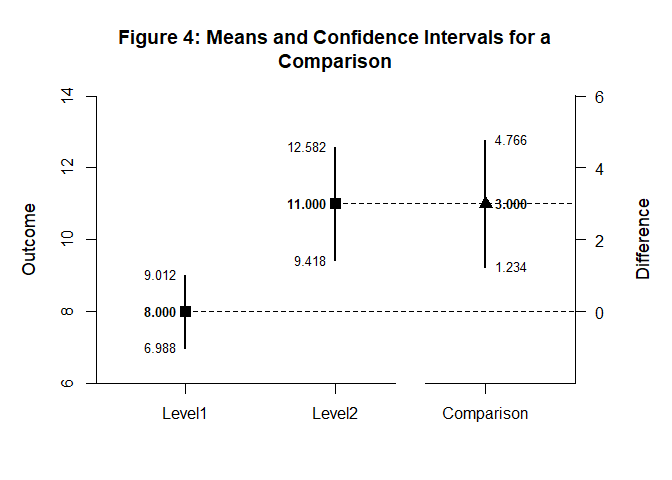

# [`DEVISE`](https://github.com/cwendorf/DEVISE/)

## Mean Comparisons with `EASI`

This vignette demonstrates two workflows with EASI: one using raw data
and one using summary statistics. Each workflow follows the same pattern
of building condition intervals, then generating a comparison.

- [Confidence Intervals from Raw Data Input](#confidence-intervals-from-raw-data-input)
- [Confidence Intervals from Summary Statistics Input](#confidence-intervals-from-summary-statistics-input)

------------------------------------------------------------------------

### Confidence Intervals from Raw Data Input

Create a factor and outcome vector for the raw-data workflow.

``` r
gl(3, 10, labels = c("Level1", "Level2", "Level3")) -> Factor
c(6, 8, 6, 8, 10, 8, 10, 9, 8, 7, 7, 13, 11, 10, 13, 8, 11, 14, 12, 11, 9, 16, 11, 12, 15, 13, 9, 14, 11, 10) -> Outcome
```

Estimate condition means and intervals from the raw data.

``` r
(Outcome~Factor) |> estimateMeans() -> Conditions
```

Format and visualize the condition intervals.

``` r
Conditions |> style_matrix(title = "Table 1: Means and Confidence Intervals for Conditions", style = "apa")
```


    Table 1: Means and Confidence Intervals for Conditions 

    ------------------------------------------------------------- 
                  Est         SE         df         LL         UL 
    ------------------------------------------------------------- 
    Level1      8.000      0.447      9.000      6.988      9.012
    Level2     11.000      0.699      9.000      9.418     12.582
    Level3     12.000      0.775      9.000     10.248     13.752 
    ------------------------------------------------------------- 

``` r
Conditions |> plot_conditions(title = "Figure 1: Means and Confidence Intervals for Conditions", values = TRUE)
```

<!-- -->

Estimate the comparison intervals for the selected conditions.

``` r
(Outcome ~ Factor) |> filter_rows(Factor == c("Level1", "Level2")) |> estimateComparison() -> Comparison
```

Present the comparison in a formatted table and plot.

``` r
Comparison |> style_matrix(title = "Table 2: Means and Confidence Intervals for a Comparison", style = "apa")
```


    Table 2: Means and Confidence Intervals for a Comparison 

    ----------------------------------------------------------------- 
                      Est         SE         df         LL         UL 
    ----------------------------------------------------------------- 
    Level1          8.000      0.447      9.000      6.988      9.012
    Level2         11.000      0.699      9.000      9.418     12.582
    Comparison      3.000      0.830     15.308      1.234      4.766 
    ----------------------------------------------------------------- 

``` r
Comparison |> plot_comparison(title = "Figure 2: Means and Confidence Intervals for a Comparison", values = TRUE)
```

<!-- -->

### Confidence Intervals from Summary Statistics Input

Provide summary statistics to demonstrate the summary-input workflow.

``` r
c(N = 10, M = 8.000, SD = 1.414) -> Level1
c(N = 10, M = 11.000, SD = 2.211) -> Level2
c(N = 10, M = 12.000, SD = 2.449) -> Level3
construct(Level1, Level2, Level3, class = "bsm") -> IndependentSummary
```

Estimate condition intervals from summary statistics.

``` r
IndependentSummary |> estimateMeans() -> Conditions
```

Format and visualize the condition intervals.

``` r
Conditions |> style_matrix(title = "Table 3: Means and Confidence Intervals for Conditions", style = "apa")
```


    Table 3: Means and Confidence Intervals for Conditions 

    ------------------------------------------------------------- 
                  Est         SE         df         LL         UL 
    ------------------------------------------------------------- 
    Level1      8.000      0.447      9.000      6.988      9.012
    Level2     11.000      0.699      9.000      9.418     12.582
    Level3     12.000      0.774      9.000     10.248     13.752 
    ------------------------------------------------------------- 

``` r
Conditions |> plot_conditions(title = "Figure 3: Means and Confidence Intervals for Conditions", values = TRUE)
```

<!-- -->

Compute the comparison interval for the summary-input workflow.

``` r
construct(Level1, Level2, class = "bsm") |> estimateComparison() -> Comparison
```

Present the comparison in a formatted table and plot.

``` r
Comparison |> style_matrix(title = "Table 4: Means and Confidence Intervals for a Comparison", style = "apa")
```


    Table 4: Means and Confidence Intervals for a Comparison 

    ----------------------------------------------------------------- 
                      Est         SE         df         LL         UL 
    ----------------------------------------------------------------- 
    Level1          8.000      0.447      9.000      6.988      9.012
    Level2         11.000      0.699      9.000      9.418     12.582
    Comparison      3.000      0.830     15.307      1.234      4.766 
    ----------------------------------------------------------------- 

``` r
Comparison |> plot_comparison(title = "Figure 4: Means and Confidence Intervals for a Comparison", values = TRUE)
```

<!-- -->
