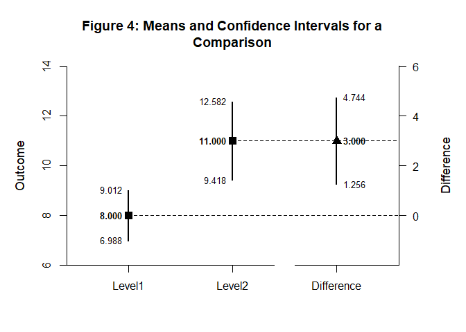

# [`DEVISE`](https://github.com/cwendorf/DEVISE/)

## Mean Comparisons with `statpsych` and `spTools`

This vignette demonstrates two approaches: `statpsych` functions alone,
and a combined `statpsych` + `spTools` workflow. Each approach computes
condition intervals and then a direct comparison.

- [Case 1: Summary Statistics Input](#case-1-summary-statistics-input)
- [Case 2: Summary Statistics Input with spTools](#case-2-summary-statistics-input-with-sptools)

------------------------------------------------------------------------

### Case 1: Summary Statistics Input

#### Examine the Conditions

Compute condition intervals using `statpsych` functions.

``` r
ci.mean(alpha = .05, m = 8.000, sd = 1.414, n = 10) |> extract_intervals() -> Level1
ci.mean(alpha = .05, m = 11.000, sd = 2.211, n = 10) |> extract_intervals() -> Level2
ci.mean(alpha = .05, m = 12.000, sd = 2.449, n = 10) |> extract_intervals() -> Level3

rbind(Level1, Level2, Level3) -> Conditions
c("Level1", "Level2", "Level3") -> rownames(Conditions)
```

#### Display the Conditions

Format and visualize the condition intervals.

``` r
Conditions |> style_matrix(title = "Table 1: Means and Confidence Intervals for Conditions", style = "apa")
```


    Table 1: Means and Confidence Intervals for Conditions 

    --------------------------------------- 
             Estimate         LL         UL 
    --------------------------------------- 
    Level1      8.000      6.988      9.012
    Level2     11.000      9.418     12.582
    Level3     12.000     10.248     13.752 
    --------------------------------------- 

``` r
Conditions |> plot_conditions(title = "Figure 1: Means and Confidence Intervals for Conditions", values = TRUE)
```

<!-- -->

#### Examine a Comparison

Compute the comparison interval between two conditions.

``` r
ci.mean2(alpha = .05, 11.000, 8.000, 2.211, 1.414, 10, 10) |> extract_intervals() |> extract_rows(1) -> Difference

rbind(Level1, Level2, Difference) -> Comparison
c("Level1", "Level2", "Difference") -> rownames(Comparison)
```

#### Display a Comparison

Present the comparison in a formatted table and plot.

``` r
Comparison |> style_matrix(title = "Table 2: Means and Confidence Intervals for a Comparison", style = "apa")
```


    Table 2: Means and Confidence Intervals for a Comparison 

    ------------------------------------------- 
                 Estimate         LL         UL 
    ------------------------------------------- 
    Level1          8.000      6.988      9.012
    Level2         11.000      9.418     12.582
    Difference      3.000      1.256      4.744 
    ------------------------------------------- 

``` r
Comparison |> plot_comparison(title = "Figure 2: Means and Confidence Intervals for a Comparison", values = TRUE)
```

<!-- -->

### Case 2: Summary Statistics Input with `spTools`

#### Examine the Conditions

Compute condition intervals using vectorized functions from `statpsych`
and `spTools`.

``` r
ci.mean.vec(alpha = .05, m = c(8.000, 11.000, 12.000), sd = c(1.414, 2.211, 2.449), n = c(10, 10, 10)) |> extract_intervals() -> Conditions
c("Level1", "Level2", "Level3") -> rownames(Conditions)
```

#### Display the Conditions

Format and visualize the condition intervals.

``` r
Conditions |> style_matrix(title = "Table 3: Means and Confidence Intervals for Conditions", style = "apa")
```


    Table 3: Means and Confidence Intervals for Conditions 

    --------------------------------------- 
             Estimate         LL         UL 
    --------------------------------------- 
    Level1      8.000      6.988      9.012
    Level2     11.000      9.418     12.582
    Level3     12.000     10.248     13.752 
    --------------------------------------- 

``` r
Conditions |> plot_conditions(title = "Figure 3: Means and Confidence Intervals for Conditions", values = TRUE)
```

<!-- -->

#### Examine a Comparison

Compute the comparison interval between two conditions.

``` r
ci.mean2.vec(alpha = .05, m = c(11.000, 8.000), sd = c(2.211, 1.414), n = c(10, 10)) |> extract_intervals() |> extract_rows(1) -> Difference

rbind(Conditions[1,], Conditions[2,], Difference) -> Comparison
c("Level1", "Level2", "Difference") -> rownames(Comparison)
```

#### Display a Comparison

Present the comparison in a formatted table and plot.

``` r
Comparison |> style_matrix(title = "Table 4: Means and Confidence Intervals for a Comparison", style = "apa")
```


    Table 4: Means and Confidence Intervals for a Comparison 

    ------------------------------------------- 
                 Estimate         LL         UL 
    ------------------------------------------- 
    Level1          8.000      6.988      9.012
    Level2         11.000      9.418     12.582
    Difference      3.000      1.256      4.744 
    ------------------------------------------- 

``` r
Comparison |> plot_comparison(title = "Figure 4: Means and Confidence Intervals for a Comparison", values = TRUE)
```

<!-- -->
