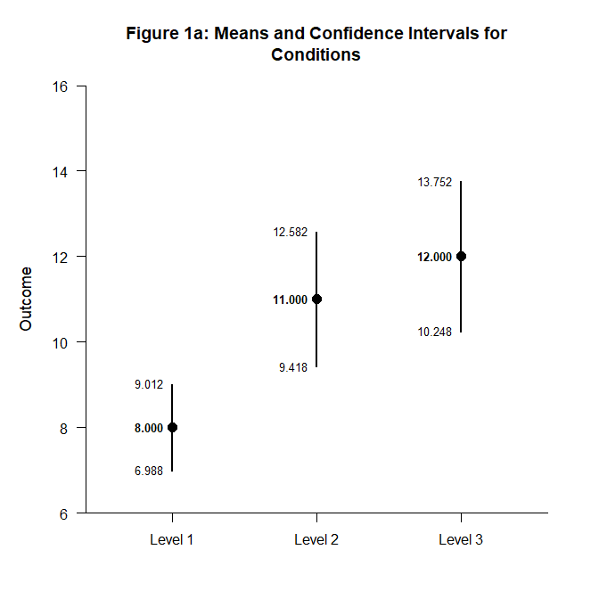
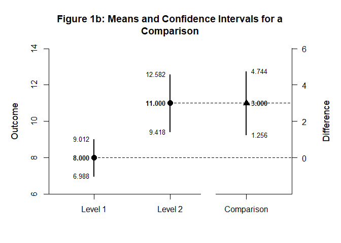
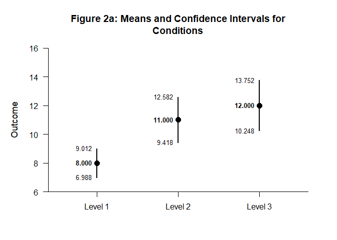

# [`DEVISE`](https://github.com/cwendorf/DEVISE/)

## Mean Comparisons with `statpsych` and `spTools`

This vignette demonstrates two approaches: `statpsych` functions alone,
and a combined `statpsych` + `spTools` workflow. Each approach computes
condition intervals and then a direct comparison.

- [Confidence Intervals from Summary Statistics Input Using `statpsych`](#confidence-intervals-from-summary-statistics-input-using-%60statpsych%60)
- [Confidence Intervals from Summary Statistics Input Using `statpsych` and `spTools`](#confidence-intervals-from-summary-statistics-input-using-%60statpsych%60-and-%60sptools%60)

------------------------------------------------------------------------

### Confidence Intervals from Summary Statistics Input Using `statpsych`

Compute condition intervals using `statpsych` functions.

``` r
ci.mean(alpha = .05, m = 8.000, sd = 1.414, n = 10) |> extract_intervals() -> Level1
ci.mean(alpha = .05, m = 11.000, sd = 2.211, n = 10) |> extract_intervals() -> Level2
ci.mean(alpha = .05, m = 12.000, sd = 2.449, n = 10) |> extract_intervals() -> Level3
rbind(Level1, Level2, Level3) |> name_rows(c("Level 1", "Level 2", "Level 3")) -> Conditions
```

Format and visualize the condition intervals.

``` r
Conditions |> style_matrix(title = "Table 1a: Means and Confidence Intervals for Conditions")
```


    Table 1a: Means and Confidence Intervals for Conditions 

    ---------------------------------------- 
              Estimate         LL         UL 
    ---------------------------------------- 
    Level 1      8.000      6.988      9.012
    Level 2     11.000      9.418     12.582
    Level 3     12.000     10.248     13.752 
    ---------------------------------------- 

``` r
Conditions |> plot_conditions(title = "Figure 1a: Means and Confidence Intervals for Conditions")
```

<!-- -->

Compute the comparison interval between two conditions.

``` r
ci.mean2(alpha = .05, 11.000, 8.000, 2.211, 1.414, 10, 10) |> extract_intervals() |> extract_rows(1) -> Difference
rbind(Level1, Level2, Difference) |> name_rows(c("Level 1", "Level 2", "Comparison")) -> Comparison
```

Present the comparison in a formatted table and plot.

``` r
Comparison |> style_matrix(title = "Table 1b: Means and Confidence Intervals for a Comparison")
```


    Table 1b: Means and Confidence Intervals for a Comparison 

    ------------------------------------------- 
                 Estimate         LL         UL 
    ------------------------------------------- 
    Level 1         8.000      6.988      9.012
    Level 2        11.000      9.418     12.582
    Comparison      3.000      1.256      4.744 
    ------------------------------------------- 

``` r
Comparison |> plot_comparison(title = "Figure 1b: Means and Confidence Intervals for a Comparison")
```

<!-- -->

### Confidence Intervals from Summary Statistics Input Using `statpsych` and `spTools`

Compute condition intervals using vectorized functions from `statpsych`
and `spTools`.

``` r
ci.mean.vec(alpha = .05, m = c(8.000, 11.000, 12.000), sd = c(1.414, 2.211, 2.449), n = c(10, 10, 10)) |> extract_intervals() |> name_rows(c("Level 1", "Level 2", "Level 3")) -> Conditions
```

Format and visualize the condition intervals.

``` r
Conditions |> style_matrix(title = "Table 2a: Means and Confidence Intervals for Conditions")
```


    Table 2a: Means and Confidence Intervals for Conditions 

    ---------------------------------------- 
              Estimate         LL         UL 
    ---------------------------------------- 
    Level 1      8.000      6.988      9.012
    Level 2     11.000      9.418     12.582
    Level 3     12.000     10.248     13.752 
    ---------------------------------------- 

``` r
Conditions |> plot_conditions(title = "Figure 2a: Means and Confidence Intervals for Conditions")
```

<!-- -->

Compute the comparison intervals between two conditions.

``` r
ci.mean2.compare(alpha = .05, m = c(5.2, 6.1), sd = c(1.1, 1.3), n = c(30, 28)) |> extract_intervals() |> name_rows(c("Level 1", "Level 2", "Comparison")) -> Comparison
```

Present the comparison in a formatted table and plot.

``` r
Comparison |> style_matrix(title = "Table 2b: Means and Confidence Intervals for a Comparison")
```


    Table 2b: Means and Confidence Intervals for a Comparison 

    ------------------------------------------- 
                 Estimate         LL         UL 
    ------------------------------------------- 
    Level 1         5.200      4.789      5.611
    Level 2         6.100      5.596      6.604
    Comparison      0.900      0.268      1.532 
    ------------------------------------------- 

``` r
Comparison |> plot_comparison(title = "Figure 2b: Means and Confidence Intervals for a Comparison")
```

<!-- -->
