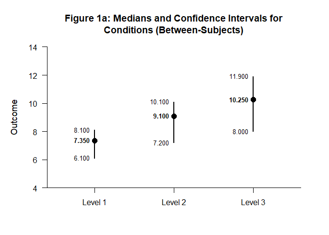
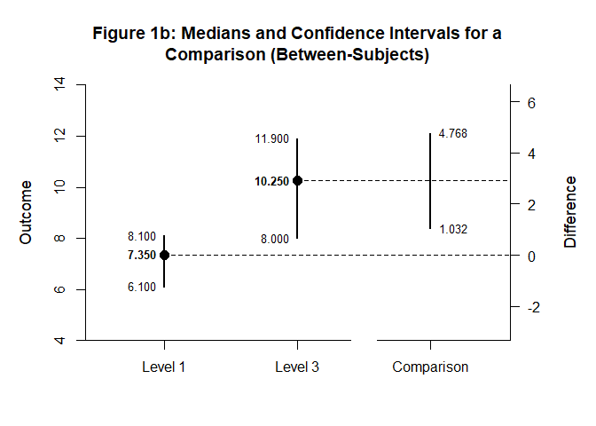
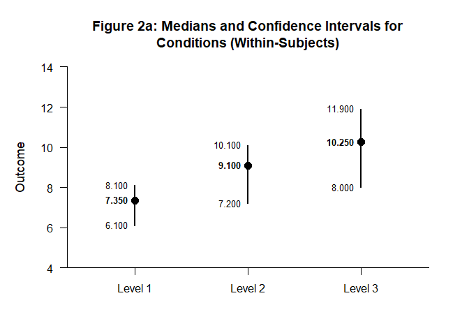
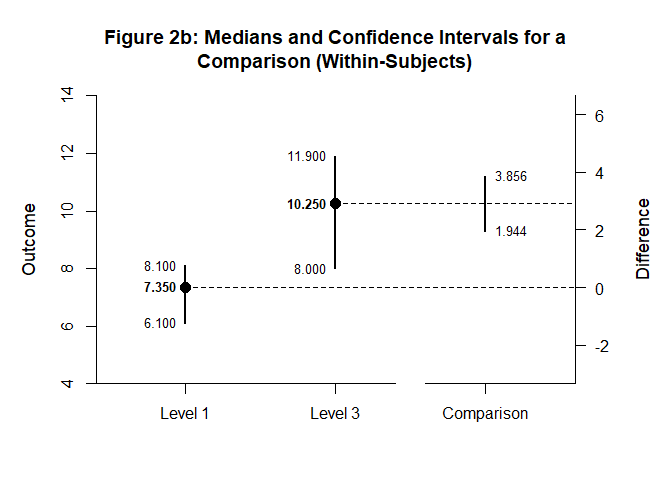

# [`DEVISE`](https://github.com/cwendorf/DEVISE/)

## Median Comparisons with `statpsych`

This vignette demonstrates median confidence-interval workflows using
`statpsych`, with parallel examples for between-subjects and
within-subjects designs.

- [Calculate Confidence Intervals (Between-Subjects Data)](#calculate-confidence-intervals-(between-subjects-data))
- [Calculate Confidence Intervals (Within-Subjects Data)](#calculate-confidence-intervals-(within-subjects-data))

------------------------------------------------------------------------

### Calculate Confidence Intervals (Between-Subjects Data)

Enter the data.

``` r
y1 <- c(5.4, 6.1, 6.8, 7.0, 7.2, 7.5, 7.7, 7.9, 8.1, 8.4)
y2 <- c(6.0, 7.2, 8.1, 8.7, 9.0, 9.2, 9.6, 9.9, 10.1, 10.4)
y3 <- c(7.1, 8.0, 9.2, 9.8, 10.0, 10.5, 10.9, 11.3, 11.9, 12.4)
```

Compute condition intervals directly from raw observations.

``` r
ci.median(alpha = .05, y = y1) |> extract_intervals() -> Level1
ci.median(alpha = .05, y = y2) |> extract_intervals() -> Level2
ci.median(alpha = .05, y = y3) |> extract_intervals() -> Level3
rbind(Level1, Level2, Level3) |> name_rows(c("Level 1", "Level 2", "Level 3")) -> Conditions
```

Format and visualize the condition intervals.

``` r
Conditions |> style_matrix(title = "Table 1a: Medians and Confidence Intervals for Conditions (Between-Subjects)")
```


    Table 1a: Medians and Confidence Intervals for Conditions (Between-Subjects) 

    ---------------------------------------- 
              Estimate         LL         UL 
    ---------------------------------------- 
    Level 1      7.350      6.100      8.100
    Level 2      9.100      7.200     10.100
    Level 3     10.250      8.000     11.900 
    ---------------------------------------- 

``` r
Conditions |> plot_conditions(title = "Figure 1a: Medians and Confidence Intervals for Conditions (Between-Subjects)")
```

<!-- -->

Compute the comparison interval between two conditions.

``` r
ci.median2(alpha = .05, y1 = y3, y2 = y1) |> extract_intervals() -> Difference
rbind(Level1, Level3, Difference) |> name_rows(c("Level 1", "Level 3", "Comparison")) -> Comparison
```

Present the comparison in a formatted table and plot.

``` r
Comparison |> style_matrix(title = "Table 1b: Medians and Confidence Intervals for a Comparison (Between-Subjects)")
```


    Table 1b: Medians and Confidence Intervals for a Comparison (Between-Subjects) 

    ------------------------------------------- 
                 Estimate         LL         UL 
    ------------------------------------------- 
    Level 1         7.350      6.100      8.100
    Level 3        10.250      8.000     11.900
    Comparison     10.250      1.032      4.768 
    ------------------------------------------- 

``` r
Comparison |> plot_comparison(title = "Figure 1b: Medians and Confidence Intervals for a Comparison (Between-Subjects)")
```

<!-- -->

### Calculate Confidence Intervals (Within-Subjects Data)

Using the same observed values, now assume the data represents repeated
measurements from the same participants across levels.

Compute condition intervals from each level.

``` r
ci.median(alpha = .05, y = y1) |> extract_intervals() -> Level1
ci.median(alpha = .05, y = y2) |> extract_intervals() -> Level2
ci.median(alpha = .05, y = y3) |> extract_intervals() -> Level3
rbind(Level1, Level2, Level3) |> name_rows(c("Level 1", "Level 2", "Level 3")) -> Conditions
```

Format and visualize the condition intervals.

``` r
Conditions |> style_matrix(title = "Table 2a: Medians and Confidence Intervals for Conditions (Within-Subjects)")
```


    Table 2a: Medians and Confidence Intervals for Conditions (Within-Subjects) 

    ---------------------------------------- 
              Estimate         LL         UL 
    ---------------------------------------- 
    Level 1      7.350      6.100      8.100
    Level 2      9.100      7.200     10.100
    Level 3     10.250      8.000     11.900 
    ---------------------------------------- 

``` r
Conditions |> plot_conditions(title = "Figure 2a: Medians and Confidence Intervals for Conditions (Within-Subjects)")
```

<!-- -->

Compute the comparison interval between two levels using a
paired-samples median difference.

``` r
ci.median.ps(alpha = .05, y1 = y3, y2 = y1) |> extract_intervals() -> Difference
rbind(Level1, Level3, Difference) |> name_rows(c("Level 1", "Level 3", "Comparison")) -> Comparison
```

Present the comparison in a formatted table and plot.

``` r
Comparison |> style_matrix(title = "Table 2b: Medians and Confidence Intervals for a Comparison (Within-Subjects)")
```


    Table 2b: Medians and Confidence Intervals for a Comparison (Within-Subjects) 

    ------------------------------------------- 
                 Estimate         LL         UL 
    ------------------------------------------- 
    Level 1         7.350      6.100      8.100
    Level 3        10.250      8.000     11.900
    Comparison     10.250      1.944      3.856 
    ------------------------------------------- 

``` r
Comparison |> plot_comparison(title = "Figure 2b: Medians and Confidence Intervals for a Comparison (Within-Subjects)")
```

<!-- -->
